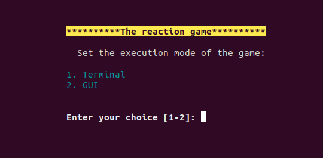
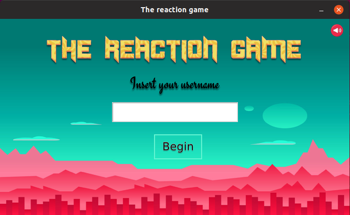
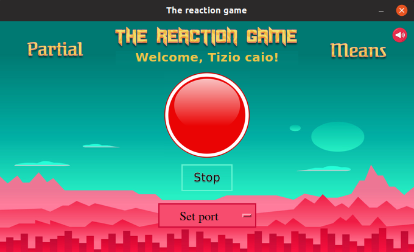
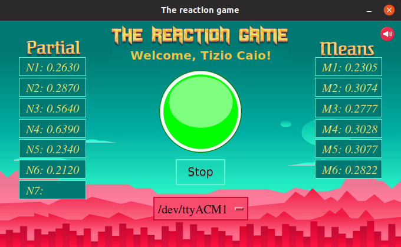
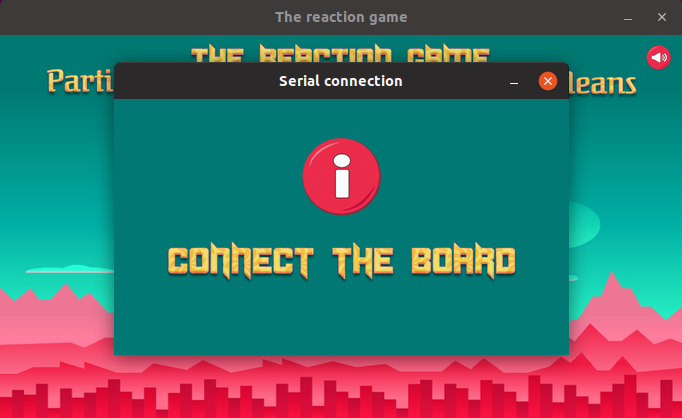
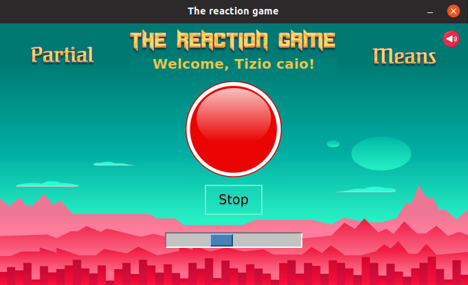
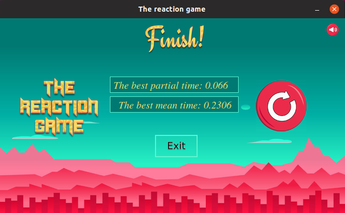

Developed at Politecnico di Torino by:
 - Andrea TRUFINI
 - Andrea MARCHESIN
 - Elia RIBALDONE
 - Federica CARTA

# TheReactionGame

*TheReactionGame* is a project based on the realization of a reflex meter with a communication through a serial interface between the *NUCLEO F4102RE* board and a generic computer.
Specificly the game is based on measurement of the time that the player spends to push a button on the board, after the power on/off of a board integrated LED which changes its state with a random time between 10 and 20 seconds.

# Two different interfaces
*TheReactionGame* is based on two different interfaces:
a) GUI (developed in Python)
b) shell interface. 

The first screen in which it is possible to choose the interface is the following one:

## GUI
### Initial window

### Main window

### Board not connected

### Board loading

### End window

## TERMINAL
The second way allows to do mainly the same things of the first one but it is developed in *bash* and there is no graphical interface.
